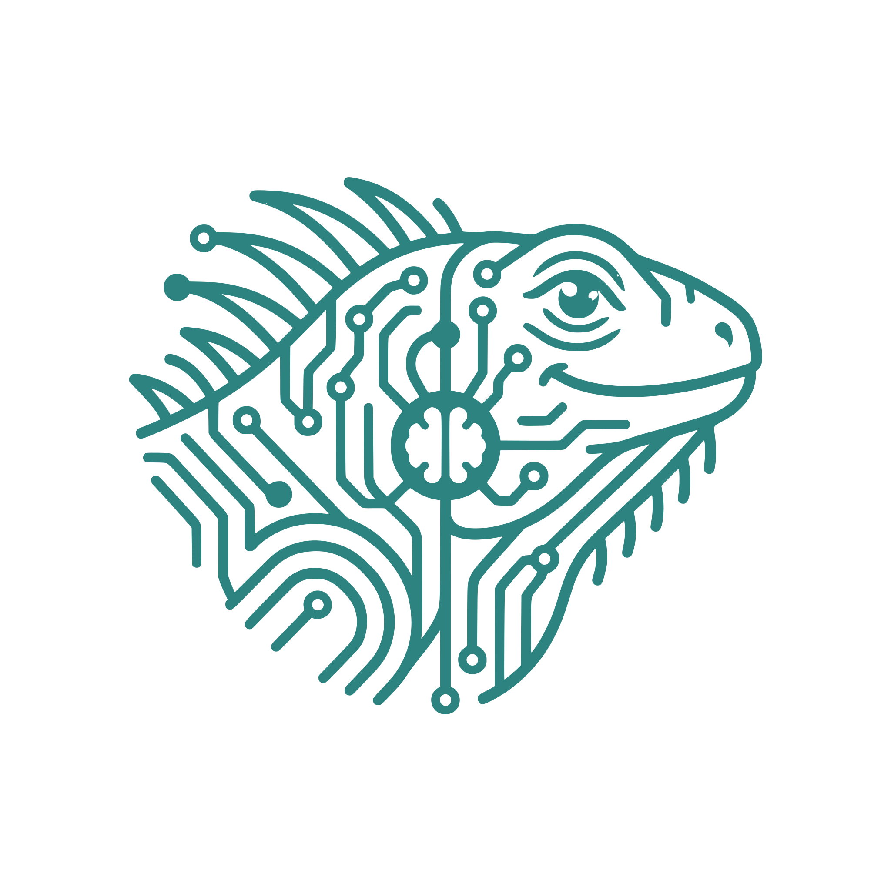

<!-- Language switcher -->

  &nbsp;
  

<!-- ═══════════════════════════════════════════════════════════════ -->
<!-- HEADER -->
<!-- ═══════════════════════════════════════════════════════════════ -->

  

 

  

&nbsp;
&nbsp;
&nbsp;
&nbsp;

  

---

## 👋 &nbsp;About me

I’m a **Computer Engineering** student at **UNISTMO**, Tehuantepec campus, writing this from Oaxaca, Mexico. I started from the bottom, wrestling with memory management and low-level logic, because I believed, and still do, that to build good software you first need to understand what happens underneath. From there I moved on to backends and mobile apps. At some point, writing code that "just works" stopped being enough: **security** and **architecture** are the rest of the job, and they’re what keeps me hooked today.

🤖 &nbsp;**What I enjoy most is working with AI.** It’s where my imagination runs loose: I use it to study, to code and to automate anything I do twice. I like how little time an idea takes to exist: build it, break it, keep what worked. That’s the part of this craft I wouldn’t trade.

☁️ &nbsp;**My path right now is the cloud, and I mean it.** Google Cloud is my base, with AWS and Azure on the way. **Cybersecurity** is what grabs me the most out of all this, and AI is the thread that ties it together. Robotics has my attention too.

🛠️ &nbsp;**What I’ve built.** A road-alert platform that shipped in **24 hours** at a hackathon ([Vía Libre Oaxaca](https://github.com/Jean1722343/via-libre2)). And, as a co-author, a **business ERP** and a **psychometric test**. I learn by building and breaking things: that’s the part that never feels like homework.

🎯 &nbsp;**What I’m looking for.** Opportunities where I can contribute from day one, and more programs, scholarships and events that push me out of my comfort zone. If you’re into cybersecurity, cloud or tech communities, reach out: I’m always up for trading ideas and technical challenges.

📫 &nbsp;Contact: **jeanpaul.gallegosc@gmail.com**

---

## 🎒 &nbsp;Programs and community

<i>Student, volunteer roles. Not jobs and not internships.</i>

<table width="100%">
  <tr>
    <td align="center" width="120">
      
    </td>
    <td>
      <b>Google Student Ambassador ’26</b> 
      
        
        
      
      
A national AI leadership program built around <b>Google Gemini</b>: live technical sessions, weekly challenges and conversations with Googlers. I bring what I learn there back to my university, and I started a <b>Gemini study group</b> on campus.

    </td>
  </tr>
  <tr>
    <td align="center" width="120">
      
    </td>
    <td>
      <b>AWS Student Builder Group Leader</b> 
      
        
        
      
      
I founded the <b>first Student Builder Group at UNISTMO</b>: I run sessions and meetups so more students from the Isthmus get to build on AWS.

    </td>
  </tr>
  <tr>
    <td align="center" width="120">
      
    </td>
    <td>
      <b>Nexis Oaxaca Tech · core team</b> 
      
        
        
      
      
A <b>youth-led initiative</b> building spaces and experiences around technology in Oaxaca, with one idea behind it: that anyone can <b>learn, connect and find opportunities</b>, no previous experience required. We run talks and workshops on AI, serverless architectures and cloud development, community meetups, and collaborations with universities and companies.

      
I’m part of the <b>core team</b> and an organizer since June 2026, and I lead the <b>scholarship program</b>. It’s <b>volunteer</b> work.

      

        &nbsp;
        
      

    </td>
  </tr>
</table>

---

## 📜 &nbsp;Official certifications

<table width="100%">
  <tr>
    <td align="center" width="120">
      
    </td>
    <td>
      <b>🛡️ Google Cloud Cybersecurity Certificate</b> 
      
        
        
        
      
      
Cloud security and infrastructure protection · identity and access management (IAM) · threat detection and incident response · security best practices across the GCP ecosystem.

      

    </td>
  </tr>
  <tr>
    <td align="center" width="120">
      
    </td>
    <td>
      <b>☁️ Google Cloud Computing Foundations Certificate</b> 
      
        
        
        
      
      
Cloud fundamentals, architecture and infrastructure on GCP · networking, IAM and load balancing · cloud-native apps and serverless functions · data, ML APIs and BigQuery.

      

    </td>
  </tr>
</table>

  

---

## 🧰 &nbsp;Tech stack

  

<table width="100%">
  <tr>
    <td width="33%" valign="top">
      <b>Languages and frameworks</b>
      

        
        
        
        
        
        
        
      

    </td>
    <td width="33%" valign="top">
      <b>Cloud and infrastructure</b>
      

        
        
        
        
        
        
      

    </td>
    <td width="33%" valign="top">
      <b>Tools</b>
      

        
        
        
        
      

    </td>
  </tr>
</table>

---

## 🚀 &nbsp;Featured project

<i>The project I learned the most from, told by what it solves and how it is built.</i>

### 🛣️ &nbsp;Vía Libre Oaxaca: real-time road-blockage alerts

An MVP built and deployed in **24 hours** for the Kiro AI Hackathon (Código Facilito &amp; AWS, Equipo Istmo). A community platform that reports road blockages across the Isthmus of Tehuantepec and reroutes you on the fly.

<table width="100%">
  <tr>
    <td width="50%" valign="top">
      <b>🌐 Web and PWA</b>
      <ul>
        <li>Static SPA with <b>Nuxt 4</b>, Vue 3, Nuxt UI 4 and Tailwind CSS v4.</li>
        <li>Interactive maps with <b>MapLibre GL</b> on OpenStreetMap.</li>
        <li>Service Workers with an <b>offline cache</b>, for low-connectivity areas.</li>
      </ul>
      <b>📱 Mobile app (Flutter)</b>
      <ul>
        <li>Background geolocation.</li>
        <li><b>Hands-free spoken alerts</b> while driving, via speech synthesis.</li>
      </ul>
    </td>
    <td width="50%" valign="top">
      <b>⚡ Serverless backend</b>
      <ul>
        <li>REST API on <b>Laravel 13 / PHP 8.3</b> running on <b>AWS Lambda</b> (Bref images).</li>
        <li>Stateless <b>JWT</b> auth and <b>RBAC</b> access control per role.</li>
        <li><b>DynamoDB</b> with secondary indexes and <b>TTL</b>: reports expire on their own.</li>
      </ul>
      <b>☁️ Infrastructure</b>
      <ul>
        <li>Lambda + API Gateway + ECR · S3 + CloudFront · Location Service · SNS · Cognito.</li>
        <li>All provisioned with modular <b>Terraform</b>, for under 10 USD.</li>
      </ul>
    </td>
  </tr>
</table>

  &nbsp;
  

---

## 📊 &nbsp;GitHub

 

---

## 🤝 &nbsp;Let’s connect

<b>I’m open to job opportunities, internships and technical collaborations.</b>

  

&nbsp;

  

I also share what I learn inside the tech programs:

 

